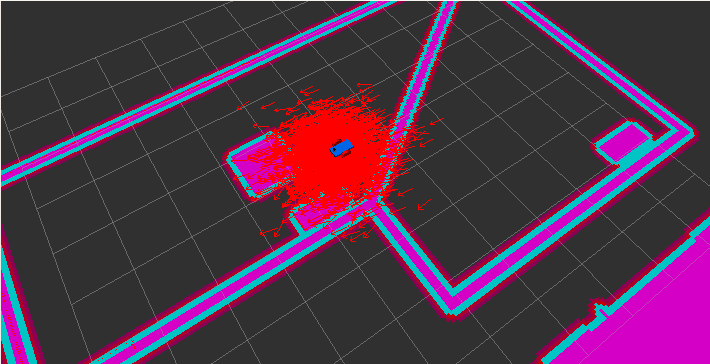
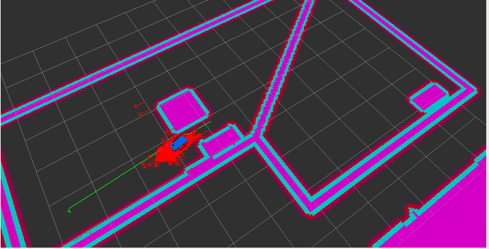
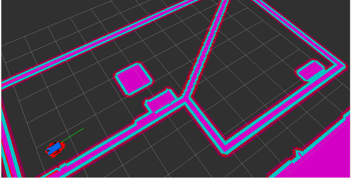

# Adaptive Monte Carlo Localization in ROS
The objective of this project is to utilize the ROS AMCL package to accurately localize my mobile robot inside it's world in the Gazebo simulation environments. My implementation can be found in the my_robot package, using the following launch commands:

```
> roslaunch my_robot world.launch
> roslaunch my_robot amcl.launch
```

By tuning the algorithm's parameters, the particles representing the robot pose quickly converge towards the true location of the bot as it moves to the nav_goal target in Rviz.






